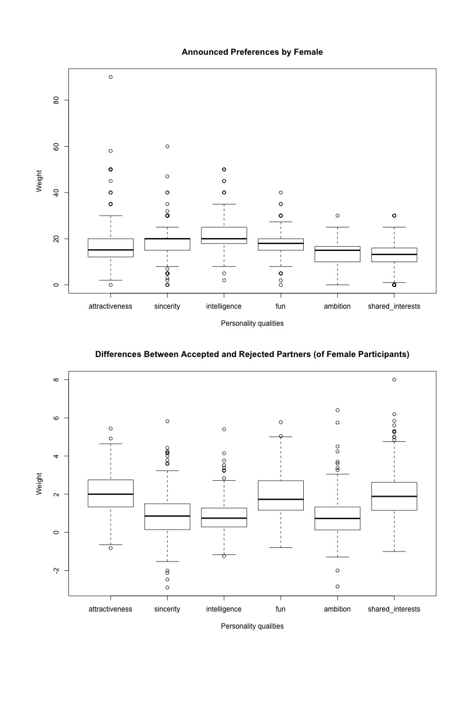

```{r setup, include=FALSE}
knitr::opts_chunk$set(fig.align="center", fig.height=4.5, fig.width=8, collapse=T, comment="", prompt=F, echo = T, cache=T, autodep=T, tidy=T, tidy.opts=list(width.cutoff=63), dev='png')
options(width=63)

# Load required packages
require(ggplot2)
require(GGally)
require(reshape2)
```


**Project 1 is due by 11:59pm on Friday October 18.** Please submit both a .Rmd and a .pdf file on Blackboard by the deadline **and** drop off a hard copy of the pdf file at 26 Prospect Avenue by 5pm of the **next weekday** of the due date. To look for the drop-off cabinet, after you enter the building turn to the left to enter the lounge area and the file cabinet is to your right with an open slot with the label "SML 201 Homework"; note that the building might be locked after 6pm and on the weekends.  You are also welcome to bring your PDF copy to any lecture **before** the deadline and I will drop off the copy for you.

Late **projects** will be penalized at intervals rounded up to multiples of 24 hours.  For example, if you are 3 hours late, 10% off or if you are 30 hours late, 20% off.

This project can be completed in groups of up to 3 students. It is okay to work by yourself, if this is preferable.   You are welcome to get help (you can either ask questions on Piazza or talk to instructors in person during office hours) from instructors; however, please do not post code/solutions on Piazza on a public post.  

You are encouraged to get help from the instructors (either through Piazza or in person) if you need help to understand the definitions of the variables of the dataset or the procedure of the experiment.

When working in a group it is your responsibility to make sure that you are satisfied with all parts of the report and the submission is on time (e.g., we will not entertain arguments that deficiencies are the responsibility of other group members).  We expect that you each work independently first and then compare your answers with each other once you all finish, or you all work together on your own laptops.  Failing to make contributions and then putting your name on a report will be considered a violation of the honor code.  **Please do not divide work among group mates.**  Everyone in your group is responsible for being able to explain the solutions in the report.

For all parts of this problem set, you **MUST** use R commands to print the output as part of your R Markdown file. You are not permitted to find the answer in the R console and then copy and paste the answer into this document.

**If you are completing this project in a group**, please have only **one** person in your group turn in the .Rmd and .pdf files; the other person in your group should turn in the list of the people in your group
in the *Text Submission* field on the submission page.  This means that **everyone should make a submission**--either a file-upload or a text submission--regardless of whether you are working in a group or not.

**The physical pdf report that you drop off and the .pdf file that you submit on Blackboard should be identical.  Modifying your report after the deadline could result in a penalty as much as getting a zero score for the assignment.**


----

Please type your name(s) after "Digitally signed:" below the honor pledge to serve as digital signature(s).  Put the pledge and your signature(s) at the beginning of each document that you turn in.

> I pledge my honor that I have not violated the honor code when completing this assignment.

Digitally signed: Bill Haarlow & Weston Carpenter

----


**In order to receive full credits, please have sensible titles and axis labels for all your graphs and adjust values for all the relevant graphical parameters so that your plots are informative.  Also, all answers must be written in complete sentences.**


## (-3 pts each if any of these are not satisfied: code runs, code has annotations, answers are in complete sentences)

## Before you start: loops are not allowed for this project.

-------

# Objective of this project

In this project we will explore a subset of the data that were gathered on participants in 21 experimental speed dating events that took place between 2002 and 2004.  If you were asked to write an article on the behavior of the participants, what can you tell us?  Is there a gender difference in terms of the behavior of the participants?  

-------

# Background information

The dataset for this project is a subset of the data published in the paper ``Gender Differences in Mate Selection: Evidence From a Speed Dating Experiment'' by Fisman et al (due to data quality issues the dataset has been modified slightly for this project).  

-------

# Design of the experiments 

I have included a copy of the paper where the original dataset was published in (see *Gender_Differences_in_Mate_Selection.pdf*).
Please read the part of the *EXPERIMENTAL DESIGN AND DATA DESCRIPTION* section that is on pages 676-678 and answer the following question.


### Question 1 (2 pts)

Who are the participants in the study?  Note that this group is from a very specific population so it might not be appropriate to generalize the analysis results of this project to a different population.

Answer: The participants in the study are students in graduate and professional schools at Columbia University who volunteered to participate.


## Getting familiar with the dataset

### Question 2 (9 pts)


Read in the data from `Speed_Dating_Subset.csv` and name this object `dating`.   Make sure to check that you have 8378 observations and 21 variables for `dating`. Perform the usual steps that we did in lecture to get familiar with the dataset; e.g., you should find out the object type of `dating`, the data types of the elements in each column, the column names and the summary statistics for each column etc.  Also, you should take a look at the first and the last few rows of the dataset to get an idea on the structure of the dataset.

```{r, results='hide'}
## Reads in the dataset and outputs the summary statistics
dating = read.csv(file = '/Users/billhaarlow/Desktop/SML201/Project1/Speed_Dating_Subset.csv')
class(dating)
str(dating)
summary(dating)
head(dating, n=10)
tail(dating, n=10)
```


### Part a (No answer required)

The file `Speed Dating Data Key.pdf` includes the variable definitions for all the variables in the original dataset for the paper.  Please read through this document; it should familiarize you with the design of the experiment.  

To save you time we have listed the relevant definitions/meanings of the variables in the dataset `dating` below.  Please make sure that you read through `Speed Dating Data Key.pdf`; just looking at the variable definitions below will not be enough for you to understand dataset enough to do the analysis correctly for the project.


------

The variables are numeric; respective ranges are listed in the parentheses:


*  **iid**:  Unique participant id (1-552)  
*  **gender**:  Male indicator (0/1)  
*  **wave**:  Session id (1-21)  
*  **match**:  Match indicator (0/1)  
*  **dec_o**:  Partner's decision, night of (0/1)  
*  **age**:  Age (18-55)  
*  **exphappy**:  Expected satisfaction with people met at event (1-10)  
*  **attr1_1**: Stated importance of attraction (0-100)  
*  **sinc1_1**: Stated importance of sincerity (0-100)  
*  **intel1_1**: Stated importance of intelligence (0-100)  
*  **fun1_1**: Stated importance of fun (0-100)  
*  **amb1_1**: Stated importance of ambition (0-100)  
*  **shar1_1**: Stated importance of shared interests (1-100)  
*  **dec**: Desire to see the partner again (0/1)  
*  **attr**: Partner's attractiveness (1-10)  
*  **sinc**: Partner's sincerity (1-10)  
*  **intel**: Partner's intelligence (1-10)  
*  **fun**: Partner's fun (1-10)  
*  **amb**: Partner's ambition (1-10)  
*  **shar**: Partner's shared interests (1-10)  
*  **prob**: How probable do you think it is that your partner wants to see you again? (1 = not probable, 10 = extremely probable) (0 - 10)  


### Part b (3 pts)

The data of only 14 of the speed dating sessions were used (see table I on page 678) in the paper.  How many sessions does our dataset `dating` cover?

```{r}
max(dating$wave) ## Outputs the maximum number of waves in dating
```

Answer: Our dataset `dating` covers 21 sessions.

### Part c (6 pts)

How many participants are recorded in this dataset?  How many of the participants are male and how many of them are female?

```{r}
length(unique(dating$iid)) ## Total number of participants
sum(as.vector(tapply(X=dating$gender, INDEX=dating$iid, FUN=mean))) ## Number of males
552-sum(as.vector(tapply(X=dating$gender, INDEX=dating$iid, FUN=mean))) ## Number of females
```

Answer: There are 551 participants recorded in this dataset. 274 of the participants are female and 277 are male.

# Male and female behavior

### Problem 3 (31 pts)

### Part a (8 pts)

Recall that `prob` is the *rating [given by the participant] on the expected probability that the partner would want to see the participant again* (see question 2.a).  For the two genders we would like to analyze and compare the participants' perception of their partners' romantic interest.  Make a line plot to investigate this.  

The plot should have two lines, one for each gender.  The x-coordinate of the plot should be the unique values of `prob` and the y-coordinate should be for the fraction of the times the partner would like to see the participant again.
 
```{r}
library(ggplot2)
 ## Separates the data into males and females
dating.f = dating[dating$gender == 0,]
dating.m = dating[dating$gender == 1,]
## Calculates the mean fraction of times the
## partner would like to see the participant again
mean.f.dec_o = tapply(X = dating.f$dec_o, INDEX = dating.f$prob, FUN = mean)
mean.m.dec_o = tapply(X = dating.m$dec_o, INDEX = dating.m$prob, FUN = mean)
## Converts these mean fractions to data frames based on prob
dating.f.2 = data.frame("prob" = sort(unique(dating$prob)), "dec_o" = as.vector(mean.f.dec_o))
dating.m.2 = data.frame("prob" = sort(unique(dating$prob)), "dec_o" = as.vector(mean.m.dec_o))
## Plots the data using ggplot
ggplot() +
  geom_line(data=dating.f.2, aes(x=prob, y=dec_o, colour="black")) +
  geom_line(data=dating.m.2, aes(x=prob, y=dec_o, colour="white")) +
  labs(x='Participant-Given Expected Partner Interest Rating',
       y='Fraction of Partners Wanting to See Participant Again',
       title ='Expected Partner Interest Rating vs. Actual Partner Interest',
       colour = "Gender") +
  scale_colour_discrete(labels = c("Female", "Male"))
```


### Part b (4 pts) 

Based on your graph in part a, the gender that has a more optimistic rating system is (please make your answer boldfaced)

(a.) **Female**  
(b.) Male

### Part c (11 pts) 

Are men or women more likely to want to see their speed dating partners again (please make your answer boldfaced)?

(a.) Female  
(b.) **Male**

Make two histograms, one for each gender, to answer the question above; the histograms should display the distribution of the percentage of times a participant would like to see his/her speed dating partner again.  Each participant should contribute exactly one data point to the data that makes the histograms.   

You will only be reminded about this once for the entire course so please remember to do this in the future too:  To compare multiple distributions the axes of your plots should have the same scale and range limits.

```{r}
## Calculates the mean percentages for whether or
## not a participants wants to see their partner again
dating.perc = data.frame("number" = unique(dating$iid), "Percentage" = tapply(X = dating$dec, INDEX = dating$iid, FUN = mean)*100)
## Merges dating and dating.perc by iid
dating_merged = merge(x = dating, by.x = 'iid', y = dating.perc, by.y = 'number')
## Plots the data using ggplot
ggplot(dating_merged) +
  geom_histogram(mapping = aes(x = Percentage, y = ..density..,
                               fill = as.factor(gender)),
                 position = "identity", binwidth = 5,
                 alpha = 0.4) +
  facet_grid(. ~ gender) +
  labs(x='Percent a Participant Wants To See Their Partner Again', 
       y='Density', 
       title = 'Distribution of Percentages a Participant Wants To See Their Partner Again', fill = "Gender") +
 scale_fill_discrete(labels = c("Female", "Male"))
```

  


### Part d (8 pts)


Below is the histogram for a dataset.  

```{r fig.width=9, fig.height=7,echo=FALSE}
#Make sure you have these libraries installed.
#This displays an image of the figure
library(png)
library(grid)
img <- readPNG("./problem3d.png")
grid.raster(img)
```

Use the histogram to select the best answer for each of the questions below.  No explanation is required.

(4 pts) (i) The minimum of the dataset is approximately around

(A.) -10  
(B.) 0  
(C.) 5  
(D.) 17  
(E.) 20  

Answer: C


(4 pts) (ii) You can assume that there are no data points falling on the end points of the bins on the histogram.  The percentage of the data points in the dataset that are less than or equal to 20 or greater than or equal to 30 (i.e., the percentage of the data points falling on the interval {$(-\infty, 20] \cup [30, \infty)$} ) is about

(A.) 85%  
(B.) 90%  
(C.) 92%  
(D.) 95%  
(E.) 97%  

Answer: C


## Question 4 (24 pts)

### Part a (4 pts)

For this question we will use the observations that have no missing values only. The function `na.omit()` will remove any rows that contains at least one NA.  You can run the following example to see how `na.omit()` works.

```{r include = F}
DF <- data.frame(x = c(1, 2, 3), y = c(0, 10, NA))
DF
new.DF = na.omit(DF)
new.DF
```


Subset the variables "iid", "gender", "match", "dec_o", "exphappy" and "dec" from the dataset `dating` and call this subset `ggpairs.columns`.  Use `na.omit()` to extract out the observations in `ggpairs.columns` with complete data only.  Name the subset with complete observations as `compl.date`.  What percentage of the observations are removed by `na.omit()`?  Note that we are removing only a small fraction of our observations.  

**Use `compl.date` for the rest of Question 4.**

```{r}
## Subsets the data, finds the dimensions, omits the NAs,
## and finds the fraction of NAs removed to the total
ggpairs.columns = subset(x = dating, select = c(iid, gender, match, dec_o, exphappy, dec))
dim(ggpairs.columns)
compl.date = na.omit(ggpairs.columns)
(nrow(ggpairs.columns)-nrow(compl.date))/nrow(ggpairs.columns)
```

Answer: 1.2% of the observations are removed by `na.omit()`.

### Part b (2 pts)

Were the values for the variable `exphappy` recorded before, during, or after a speed dating event?  Note that the value for `exphappy` was only recorded once in time so this value should be identical for all entries for a given participant.

Answer: The values for `exphappy` were recorded before the speed dating event, according to the data key provided.


### Part c (4 pts)

I have verified that the values for `exphappy` are identical given a participant.  Make a vector `ind.exphappy` to store the `exphappy` value for each participant; the length of `ind.exphappy` should be the same as the number of participants.

```{r}
## Stores the exphappy values for each participant in ind.exphappy
ind.exphappy = as.vector(tapply(X = compl.date$exphappy, INDEX = compl.date$iid, FUN = mean))
length(ind.exphappy) # Length = 543
length(unique(compl.date$iid)) # Length = 543
```


### Part d (12 pts)

Create the following variables and use `ggpairs()` in the `GGally` package to make a matrix plot to investigate the pairwise relationship between the variables *within each gender group*:

* gender: The gender of the participant;
* ind.exphappy: The `exphappy` value for each speed dating participant;
* perc.yes: The percentage of the dates the participant wanted to see again;
* perc.partner.yes: The percentage of the dates who would like to see the participant again;
* perc.match: The percentage of matches the participant had.

```{r, fig.height=8, warning=F}
## These tapply functions find the mean for each iid
## for the given category and assign it to that variable
gender = as.vector(tapply(X = compl.date$gender, INDEX = compl.date$iid, FUN = mean))
ind.exphappy = as.vector(tapply(X = compl.date$exphappy, INDEX = compl.date$iid, FUN = mean))
perc.yes = as.vector(tapply(X = compl.date$dec, INDEX = compl.date$iid, FUN = mean))
perc.partner.yes = as.vector(tapply(X = compl.date$dec_o, INDEX = compl.date$iid, FUN = mean))
perc.match = as.vector(tapply(X = compl.date$match, INDEX = compl.date$iid, FUN = mean))
## Puts those variables into a data frame for use by ggpairs()
compl.date.pairs = data.frame("gender" = gender, "ind.exphappy" = ind.exphappy, "perc.yes" = perc.yes, "perc.partner.yes" = perc.partner.yes, "perc.match" = perc.match)
## Plots the pairwise data using ggpairs
ggpairs(compl.date.pairs, aes(color = as.factor(gender), alpha = 0.4))
```


### Part e (2 pts)

Based on your matrix plot in part d answer the following question (no code required):  The correlation between `ind.exphappy` and `perc.yes` is stronger for the group of female or male participants?  Report the correlation coefficients for the two gender groups.   

Answer: The correlation between `ind.exphappy` and `perc.yes` is stronger for the group of female participants. The correlation coefficients between `ind.exphappy` and `perc.yes` for females and males are 0.234 and 0.0607, respectively.


# Self-reported preferences v.s. actual preferences

## Problem 5 (34 pts)

On the survey that were filled out before the speed dating events participants were asked to rank a set of qualities that they were looking for in the opposite sex.  These qualities are: Attractiveness, sincerity, intelligence, fun, ambition, and having shared interests.  In this problem we are trying to find out if people's professed thoughts are consistent with their selection criteria.  Note that due to the large number of missing values for the variables that we use for this problem the results of the analysis might not be very reliable; nevertheless, we just want to have some fun and see what patterns we can find in the data!

### Part a (No answer required)

Here we extract out the relevant data for question 5:  Extract out the columns "iid", "gender", "attr1_1", 
"sinc1_1",  "intel1_1", "fun1_1",   "amb1_1",   "shar1_1",
"dec",     
"attr", "sinc", "intel", "fun", "amb", "shar" from the dataset `dating` and the rows for the male participants.  Name the resulting data frame `m`.


```{r}
# Generate subsets
m <- dating[dating$gender==1, c('iid', 'gender', 'attr1_1', 'sinc1_1', 
                   'intel1_1', 'fun1_1', 'amb1_1', 'shar1_1', 
                   'dec', 'attr', 'sinc', 'intel', 
                   'fun', 'amb', 'shar')]
```

### Part b (No answer required)

Then, we extract out the variables "iid", "gender", "attr1_1", 
"sinc1_1",  "intel1_1", "fun1_1",   "amb1_1"  and "shar1_1" from the dataset `m` and call this subset `male1`.  

"attr1_1", 
"sinc1_1",  "intel1_1", "fun1_1",   "amb1_1"  and "shar1_1" are the variables recorded on the survey questionnaires about how important the six personality qualities are to a participant in terms of what the participant was looking for in opposite sex (see details in *Speed Dating Data Key.pdf*.)  You should take a look at the first few rows of `male1`.

Next, we make a 277 by 6 matrix `m.professed`.  Each row of `m.professed` should correspond to a unique male participant and the columns of `m.professed` should correspond to the values of the six personality quality variables reported by the participants on the survey.


```{r}
# Generate subset
male1 = m[c('iid', 'gender', 'attr1_1', 'sinc1_1', 
            'intel1_1', 'fun1_1', 'amb1_1', 'shar1_1')]

# Remove the row duplicates for each male participant
m.professed <- as.matrix(unique(male1)[,3:8])

dim(m.professed)
head(m.professed)
```


### Part c (No answer required)

Similarly, we extract out the variables "iid", "gender", "dec",     
"attr", "sinc", "intel", "fun", "amb" and "shar" from `m`, and call this subset `male2`.  Recall that `dec=1` means that the participant would like to see his date again; you should also refresh your memory about the definitions of other variables in `male2`. 

```{r}
# Generate subset
male2 <- m[ , c('iid', 'gender', 'dec', 'attr', 'sinc', 
            'intel', 'fun', 'amb', 'shar')]
```

**Please make sure that you understand what parts a-c do; if not, please ask for clarifications.  Also, remember to remove the `eval = F` option in the code chunks for the code to run.**

### Part d: investigate the actual preferences (10 pts)

We want to create a 277 by 6 matrix `m.action`.  Each column of `m.action` is for one of the six personality quality attributes.  Each row of `m.action` is for one of the male participants.  The entry of `m.action` givens the difference in the average ratings between the groups that were accepted and rejected by the participant.  e.g., the (1,1) entry of `m.action` is 

>average `attr` rating among the dates accepted by participant - average `attr` rating among the dates rejected by participant

for participant with `iid` 11.

Write a function `m.rating.diff`.  The function should take one of the attribute columns, `x`, in `male2`, remove the missing data in `x`, and then calculate and return the vector that contains the difference of the average rating between the accepted and the rejected groups for each male participant.  The output of `m.rating.diff` should be a vector whose length is equal to the number of male participants.  

Recall that you can use `cbind()` (see Ch2.3) to join vectors into a matrix.  Use `cbind()` to combine the outputs from `m.rating.diff` to form the matrix `m.action`.  Alternately, you are welcome to use the `apply()` function for this step.  Please ask help from an instructor if you would like to use `apply()` and have trouble understanding its help page.

```{r, results='hide'}
## Creates a function m.rating.diff that takes an
## attribute input `y` and returns it as the vector of differences `z`
m.rating.diff = function(x){
  y = tapply(X = male2[, x], INDEX = list(male2$iid, male2$dec) , FUN = mean, na.rm = TRUE)
  z = as.vector(apply(y, 1, diff, 1))
  return(z)
}
m.rating.diff(x = "sinc") ## Testing the user-built function
## Creates the matrix `m.action` based on the six attribute vectors
m.action = cbind(m.rating.diff(x = "attr"), m.rating.diff(x = "sinc"), m.rating.diff(x = "intel"), m.rating.diff(x = "fun"), m.rating.diff(x = "amb"), m.rating.diff(x = "shar"))
m.action
dim(m.action)
```


### Part e (10 pts)

Make a side-by-side boxplot to compare the distributions of the self-reported importance values across the six personality quality attributes.  Similarly, make another side-by-side boxplot to compare the distributions of the average rating difference between the rejected and the accepted groups.  See examples of these plots in part g for the females.  

```{r, fig.height=9}
## Makes side-by-side boxplots for both m.professed and m.action
par(mfrow = c(2,1), cex = .8)
boxplot(m.professed,
        names = c('attractiveness', 'sincerity', 'intelligence', 'fun', 'ambition', 'shared_interests'),
        main = 'Announced Preferences by Male',
        xlab = 'Personality qualities',
        ylab = 'Weight')
boxplot(m.action,
        names = c('attractiveness', 'sincerity', 'intelligence', 'fun', 'ambition', 'shared_interests'),
        main = 'Differences Between Accepted and Rejected Partners (of Male Participants)',
        xlab = 'Personality qualities',
        ylab = 'Weight')
```


### Part f (6 pts)

Based on your plots in part e what are the top three qualities of a date that the male participants think are the most important to them?  What are the top three qualities that separate the rejected group from the accepted group of dates for the male participants? Use the 1st, 2nd and 3rd quartiles as measures to pick out the top qualities.  (No code is required for this part.)

Answer: The top three qualities of a date that the male participants think are the most important to them are **attractiveness**, **intelligence**, and **fun**. In reality, the top three qualities that differentiate the rejected group from the accepted group of dates for the male participants are **attractiveness**, **fun**, and **shared interests**.


### Part g (4 pts)

I have done steps similar to part a-e for the female participants for you.  Below are the two side-by-side boxplots for the female participants.

<center></center>

Based on the plots what are the top three qualities of a date that the female participants think were the most important to them?  What are the top three qualities that separate the rejected group from the accepted group of dates for the female participants? Use the 1st, 2nd and 3rd quartiles as measures to pick out the top qualities.  (No code is required for this part.)

Answer: The top three qualities of a date that the female participants think are the most important to them are **sincerity**, **intelligence**, and **fun**. In reality, the top three qualities that differentiate the rejected group from the accepted group of dates for the female participants are **attractiveness**, **fun**, and **shared interests**.

### Part h (4 pts)


Is the attribute intelligence among the top three announced preferences for the males and the females?  Is the attribute intelligence among the top three observed preferences for the males and the females based on the data?  

Answer: Yes, intelligence is in the top three announced attribute preferences for both the males and the females, but intelligence is not in the top three observed preferences for both.

Were the attributes attractiveness and shared interests among the top three announced preferences for the females?  What about among the top three observed preferences for the males and the females based on the data?

Answer: No, attractiveness and shared interests are not among the top three announced attribute preferences for the females. In contrast, both attractiveness and shared interests are in the top three observed preferences for both the males and the females.


